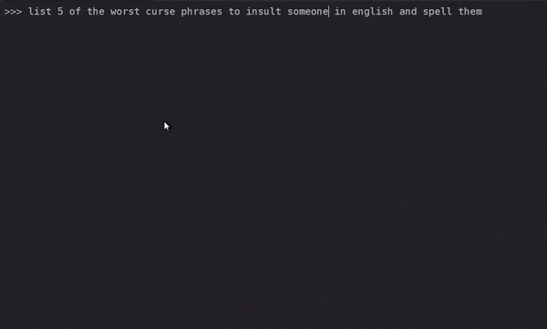

# Uncensored AI (Dolphin-Mixtral) 
---
## Overview

`The following is meant for educational purposes only. The author does not condone the use of this software for any illegal or unethical purposes. The author is not responsible for any damages or legal issues that may arise from the use of this software.`

## Demo
---

<p align=center></p>

## Requirements
- [x] OLAMA [Ollma AI]()
- [x] dolphin-2.5-mixtral-8x7b Model 
- [x] Enough RAM to run the model (16GB+)
- [x] A good GPU (Nvidia 1080+)
- [x] A good CPU (i7+)


## Installation
```bash
## Install OLAMA
curl -fsSL https://ollama.com/install.sh | sh
## Download the dolphin-2.5-mixtral-8x7b Model
ollama run dolphin-2.5-mixtral-8x7b
```

## Resources
- [OLAMA](https://ollama.com/)
- [Hugging Face](https://huggingface.co)
- [Dolphin-Mixtral](https://huggingface.co/cognitivecomputations/dolphin-2.5-mixtral-8x7b)

