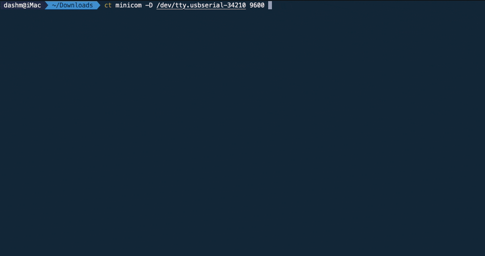

# Colorize Serial Emulator For Console Connection
---
## Description


using ChromaTerm to colorize the serial emulator output for console connection to switches, routers, firewalls, etc.

```fis
# install ChromaTerm
pip3 install chromaterm
#start minicom with colorize
minicom -c on -D /dev/ttyUSB0 9600 
```
## Screenshots



