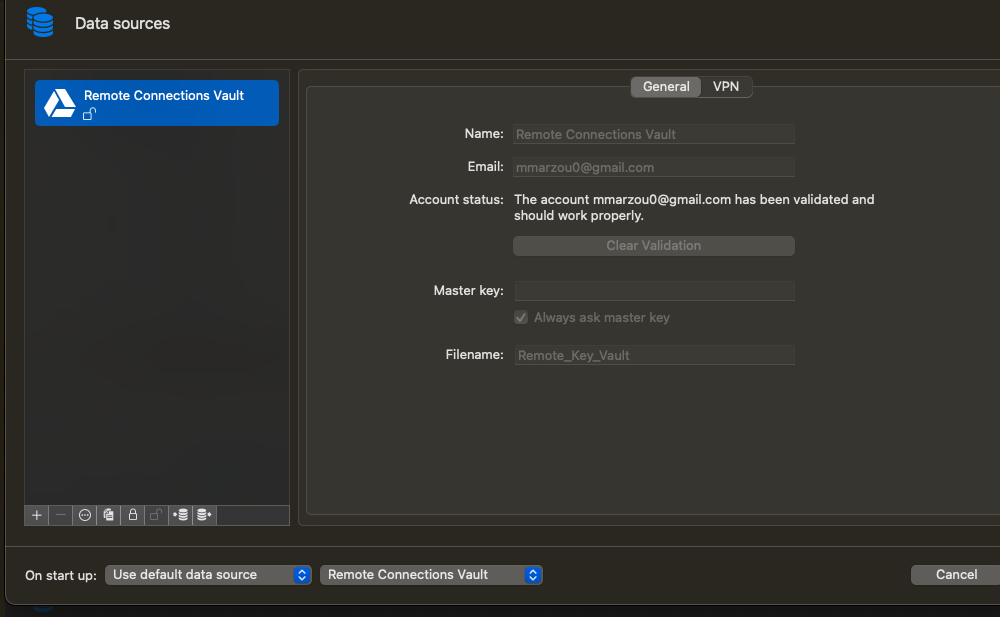
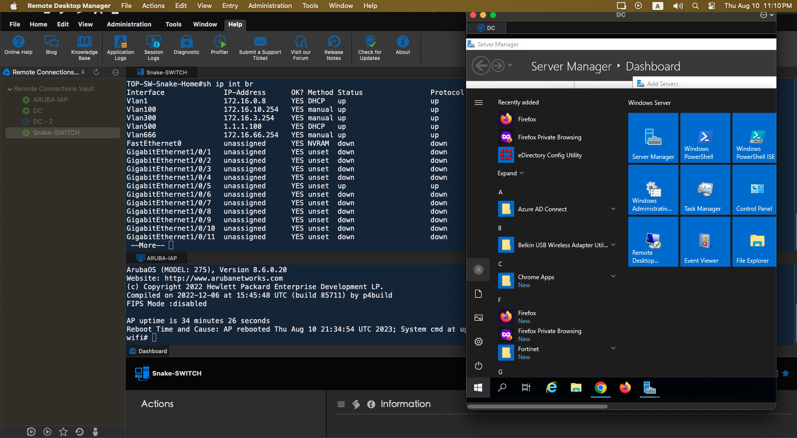

# Remote Connection Manager (Multi-Platform)
---
### Devolutions Remote Connection Manager (Multi-Platform)
---

Website:
---
### [devolutions.net](https://devolutions.net/remote-desktop-manager/home/downloadfree/)
---


## Features
1. Cloud Synchronization
2. Password Management
3. Multi-Platform
4. Multi-Protocol

## Screenshots

# Cloud Synchronization



# Multi-Protocol & Multi-Platform Support



# Password Management & Security

``
Passwords can be encrypted by a master password or a key file.
``


---
## Installation
---

<a href="https://devolutions.net/remote-desktop-manager/home/downloadfree/"> </a>

```bash
brew install --cask remote-desktop-manager-free
```
<a href="https://devolutions.net/remote-desktop-manager/home/downloadfree/"> </a>

```zsh
choco install remote-desktop-manager-free
```
<a href="https://devolutions.net/remote-desktop-manager/home/downloadfree/"> </a>

```zsh
sudo apt-get install remmina
```

---


