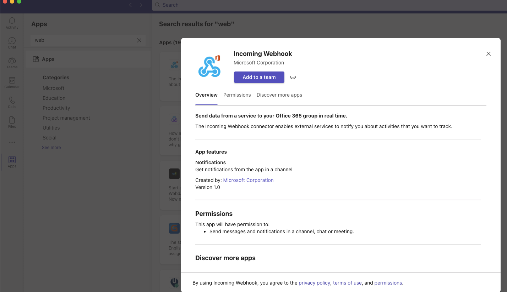
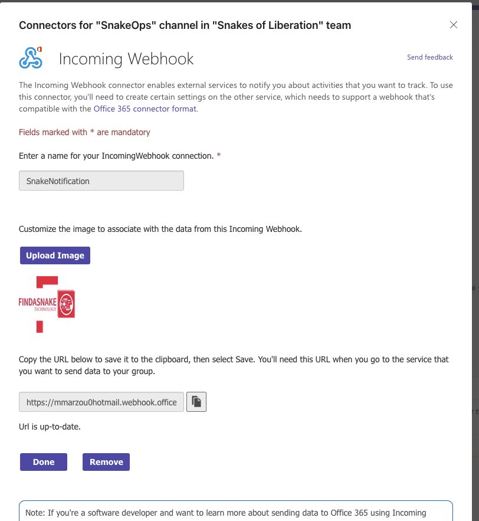
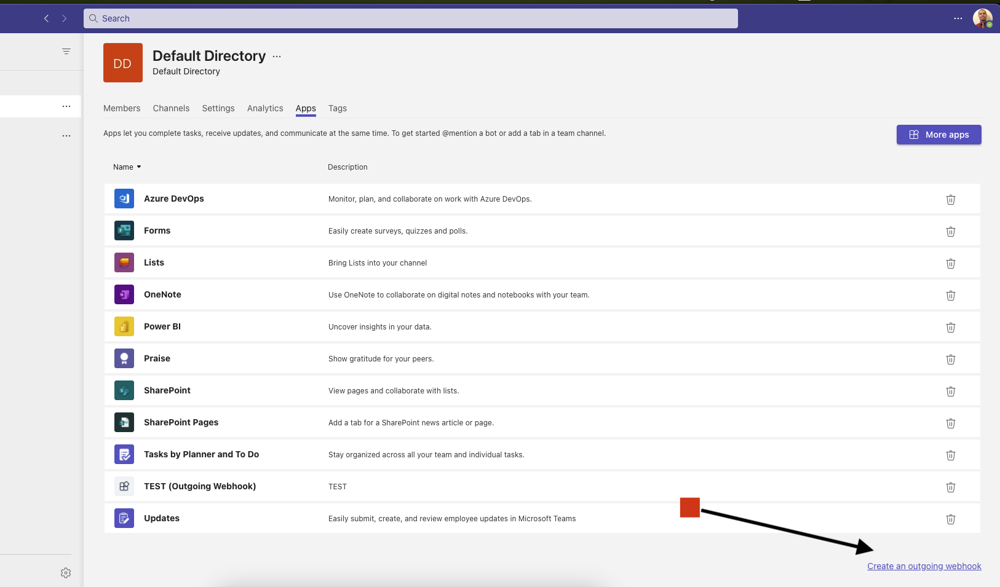

# Teams Web Hook

# Useful links
* [Actionable Messages Design Tool](https://amdesigner.azurewebsites.net/)
* [Actionable Messages Documentation](https://docs.microsoft.com/en-us/outlook/actionable-messages/)
* [Sample App](https://github.com/OfficeDev/TeamsFx-Samples/tree/dev/incoming-webhook-notification)


# Description
Webhooks and connectors help to connect the web services to channels and teams in Microsoft Teams. Webhooks are user defined HTTP callback that notifies users about any action that has taken place in the Teams channel. It's a way for an app to get real time data. Connectors allow users to subscribe to receive notifications and messages from your web services. They expose an HTTPS endpoint for your service to post messages in the form of cards.


# Demo  
### Incoming Webhook: 
- [Notification Sender - Incoming Webhook]
- [Communication Relay - Outgoing Webhook]


# Setup
1. From the apps store in the Teams client, add a webhook. [Link](https://teams.microsoft.com/l/app/203a1e2c-26cc-47ca-83ae-be98f960b6b2?source=app-details-dialog)

2. Use the webhook URL in the configuration of the Web Hook.

3. Messages sent to the Web Hook will be posted to the channel
```json
{
  "text": "Hello World"
}
```
3. Execute the command through a web browser or curl
```bash
curl -X POST -H "Content-Type: application/json" -d '{"text": "Hello World"}' http://localhost:8080
```


# Outgoing Web Hook
Outgoing Web Hooks allow you make HTTP requests to external services when a message is posted to a channel. This is useful for integrating with other services, such as GitHub, Jira, or Jenkins or local network devices.

# Incoming Web Hook
Incoming Web Hooks allow you to post messages from external sources into a channel. This is useful for posting notifications about build status, or commit messages.


# Usage

 - [Communication](Notifications can be sent to the channel by adding a new message to the Web Hook Manager. The message's title will be used as the message's subject and the message's body will be used as the message's body.)
 - [Authorization] The Web Hook will send a message to the channel whenever a new message is added to the Web Hook Manager. The message will contain the message's title and body.
 - [Integration] Outgoing web Hooks can be made to make changes/update/edit network devices, servers, and other network device i.e Forigate Firewalls support Web Hook integration.

# Notes
- [Developer Connectors Portal URL](https://aka.ms/connectorsdashboard) 


