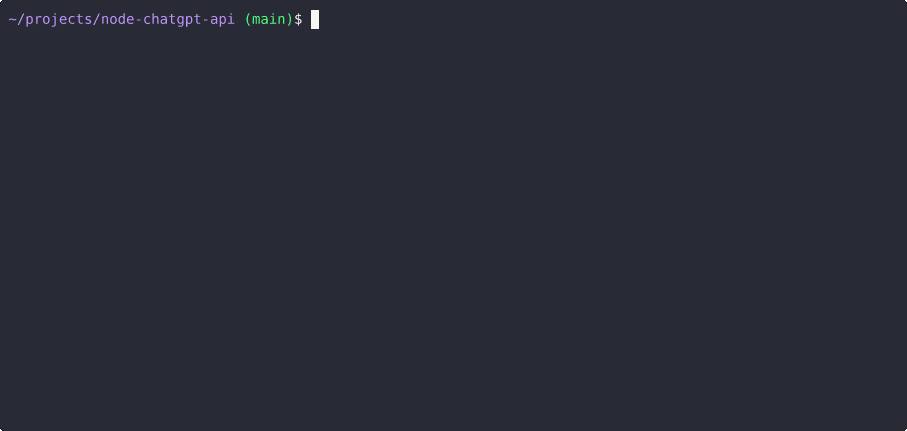

# API QUERY TOOLS

1. https://github.com/acheong08/EdgeGPT/tree/master

```
python3 -m pip install EdgeGPT --upgrade
# GO TO bing.com and export the cookie to json file

# CAN RUN FROM shell or in python code
python3 -m EdgeGPT.EdgeGPT   --cookie-file cookie.json --prompt "hi"

```

# Run with Docker
docker run --rm -it -v $(pwd)/cookies.json:/cookies.json:ro -e COOKIE_FILE='/cookies.json' ghcr.io/acheong08/edgegpt --rich --style creative

# How to use Image generator 
python3 -m ImageGen.ImageGen -h


# Generate Images
https://github.com/acheong08/BingImageCreator

# Requirements
- Cookie file from bing.com (U Value)

```
python3 -m BingImageCreator   -U 1HtZ0cGlMPesVocjLqutGBbxUsGLsZoZhOimHDo2YCBqCHEIvOsBv-n4wCzVh8XurDHqJkpQCttGEZqe36zf-sRknVXIgNH9VhvELGKAvnzuXfd_"Sending request...ye-jAFBvELNJeHpkzDlj-W7r-BcJUtioimSQ5qmIUXL4T4l2XJ2XQI3AXTNKvW3KiCg2CY2CNUkmwTpeK8cg  --prompt "Python and C++ collaborating"

```

## Sample Output


# ChatGPT Client
https://github.com/acheong08/node-chatgpt-api

## Demo


```
npm i @waylaidwanderer/chatgpt-api
npm i -g @waylaidwanderer/chatgpt-api

```

## API Key
https://chat.openai.com/api/auth/session

### settings.js
```
module.exports = {
    // Options for the Keyv cache, see https://www.npmjs.com/package/keyv.
    // This is used for storing conversations, and supports additional drivers (conversations are stored in memory by default).
    // Only applies when using `ChatGPTClient`.
    cacheOptions: {},
    // If set, `ChatGPTClient` will use `keyv-file` to store conversations to this JSON file instead of in memory.
    // However, `cacheOptions.store` will override this if set
    storageFilePath: process.env.STORAGE_FILE_PATH || './cache.json',
    // Your OpenAI API key (for `ChatGPTClient`)
    openaiApiKey: process.env.OPENAI_API_KEY || '',
    chatGptClient: {
        // (Optional) Support for a reverse proxy for the completions endpoint (private API server).
        // Warning: This will expose your `openaiApiKey` to a third party. Consider the risks before using this.
        // reverseProxyUrl: 'https://chatgpt.hato.ai/completions',
        // (Optional) Parameters as described in https://platform.openai.com/docs/api-reference/completions
        modelOptions: {
            // You can override the model name and any other parameters here.
            // model: 'text-chat-davinci-002-20221122',
            // Set max_tokens here to override the default max_tokens of 1000 for the completion.
            // max_tokens: 1000,
        },
        // (Optional) Davinci models have a max context length of 4097 tokens, but you may need to change this for other models.
        // maxContextTokens: 4097,
        // (Optional) You might want to lower this to save money if using a paid model like `text-davinci-003`.
        // Earlier messages will be dropped until the prompt is within the limit.
        // maxPromptTokens: 3097,
        // (Optional) Set custom instructions instead of "You are ChatGPT...".
        // promptPrefix: 'You are Bob, a cowboy in Western times...',
        // (Optional) Set a custom name for the user
        // userLabel: 'User',
        // (Optional) Set a custom name for ChatGPT
        // chatGptLabel: 'ChatGPT',
        // (Optional) Set to true to enable `console.debug()` logging
        debug: false,
    },
    // Options for the Bing client
    bingAiClient: {
        // Necessary for some people in different countries, e.g. China (https://cn.bing.com)
        host: '',
        // The "_U" cookie value from bing.com
        userToken: '',
        // If the above doesn't work, provide all your cookies as a string instead
        cookies: '',
        // A proxy string like "http://<ip>:<port>"
        proxy: '',
        // (Optional) Set to true to enable `console.debug()` logging
        debug: false,
    },
    chatGptBrowserClient: {
        // (Optional) Support for a reverse proxy for the completions endpoint (private API server).
        // Warning: This will expose your access token to a third party. Consider the risks before using this.
        reverseProxyUrl: 'https://chatgpt.duti.tech/api/conversation',
        // Access token from https://chat.openai.com/api/auth/session
        accessToken: '',
        // Cookies from chat.openai.com (likely not required if using reverse proxy server).
        cookies: '',
        // (Optional) Set to true to enable `console.debug()` logging
        // debug: true,
    },
    // Options for the API server
    apiOptions: {
        port: process.env.API_PORT || 3000,
        host: process.env.API_HOST || 'localhost',
        // (Optional) Set to true to enable `console.debug()` logging
        debug: false,
        // (Optional) Set to "bing" to use `BingAIClient` instead of `ChatGPTClient`.
        // clientToUse: 'bing',
    },
    // Options for the CLI app
    cliOptions: {
        // (Optional) Set to "bing" to use `BingAIClient` instead of `ChatGPTClient`.
        // clientToUse: 'bing',
    },
};
```

