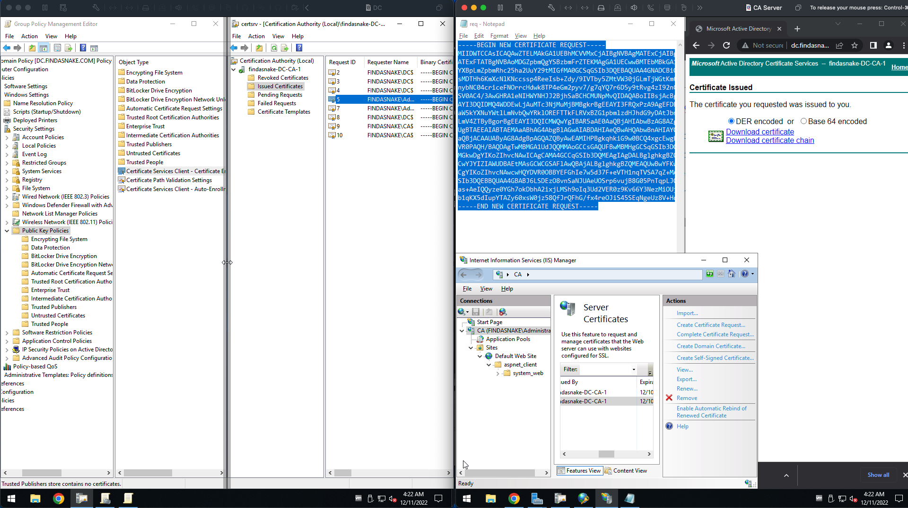

# Azure Import PFX Certificate to VM

## Description

<h1> <a href="ssl-certs.md"> READ FIRST </a> </h1>


This is a proof of concept script that imports a PFX file to a VM.  The script will create a new certificate store if one does not exist.  The script will not overwrite an existing certificate store.  The script will not overwrite an existing certificate in the certificate store.  The script will not overwrite an existing certificate in the VM's certificate store.
## Prerequisites
* Azure PowerShell
* A PFX file
* A Key Vault
* A VM with IIS installed
## Challenge
The challenge is binding the correct virtual site to the correct certificate without breaking the existing site.  The following is a sample of the IIS configuration.
## Possible Solution <a href="https://meeg.dev/blog/adding-an-https-binding-to-an-iis-website-using-powershell"> Source</a>
The possible solution is to use IISAdministration module to bind the certificate to the virtual site.  The following is a sample of the IISAdministration module.

### A. Get the SSL certificate thumbprint
```powershell
function Get-SslCert([String] $name, [String] $location, [String]$storeName) {
    $thumbprint = (Get-ChildItem "cert:\$location" | where-object { $_.Subject -like "*$name*" } | Select-Object -First 1).Thumbprint
    # Return the thumbprint along with the arguments provided for context and later usage
    return new-object psobject -property @{
        Name = $name
        Location = $location
        StoreName = $storeName
        Thumbprint = $thumbprint
    }
}
# This can be called like so if your cert's common name is "dev.example.com" and is located in your "CurrentUser" store (under Local Computer\Personal\Certificates)
$sslCert = Get-SslCert "dev.example.com" "CurrentUser\My" "My"
```

### B. Convert the thumbprint from hexadecimal to a byte array
```powershell
function HexToBytes($hex) {
$bytes = for($i = 0; $i -lt $hex.Length; $i += 2) {
        [convert]::ToByte($hex.SubString($i, 2), 16)
    }
    return $bytes
}
```
### C.  Add the HTTPS binding
```powershell
# In this example, we are creating a Website called "example-dev" with a host name of "dev.example.com" that is located under "C:\Sites\example.com"
$name = "example-dev"
$hostname = "dev.example.com"
$path = "C:\Sites\example.com"
# Get the SSL certificate
$sslCert = Get-SslCert "dev.example.com" "CurrentUser\My" "My"
# Get an IISServerManager instance
$manager = Get-IISServerManager
# Create the site with http binding
$site = $manager.Sites.Add($name, "http", "*:80:$hostname", $path)
# Convert the SSL certificate thumbprint to a byte array
$thumbprintBytes = HexToBytes $sslCert.Thumbprint
# Add https binding - this is "noisy" by default so piping to `Out-Null` suppresses the output
$site.Bindings.Add("*:443:$hostname", $thumbprintBytes, $sslCert.StoreName, 1) | Out-Null
# Commit your changes    
$manager.CommitChanges()
```


## Overview



NOTE: The server needs to be part of the domain before enabling the Certificate Authority 

	A. Add Certificate Authority Role with Web Services

	B. IN IIS Certificate Request, the Common name must be in the following format:

Subdomain.domain.com ==> www.findasnake.com

	2. Export the Request Text
	
	3. Navigate to CA.findasnake.com/certsrv/certrqxt.asp

	4. Paste the request and download the keys (SET TYPE TO WEB SERVER)
	

 have you ever pushed SSL certificate to Azure VM remotely and update the IIS? 


```

$ResourceGroupName = "WEBVM-RG"
$CertificateStoreName = "My"
$VMName = "Snake-IISVM"
$PFXFilePath = "C:\certs\mycert.pfx"
$PFXPassword = "myPFXPassword" (Optional)

# Import the PFX file to the VM
Import-PFXCertificateToVM -ResourceGroupName $ResourceGroupName -VMName $VMName -PFXFilePath $PFXFilePath    -CertificateStoreName "My" 
```

## Parameters

* **ResourceGroupName**: The name of the resource group that contains the VM.
* **VMName**: The name of the VM.
* **PFXFilePath**: The path to the PFX file.
* **PFXPassword**: The password for the PFX file.
* **CertificateStoreName**: The name of the certificate store to import the certificate to.  If the store does not exist, it will be created.

## Notes

* The script will create a new certificate store if one does not exist.
* The script will not overwrite an existing certificate store.
* The script will not overwrite an existing certificate in the certificate store.
* The script will not overwrite an existing certificate in the VM's certificate store.


## Implementation

### Create a PFX file with a self-signed certificate or a certificate from a certificate authority

```powershell
# POPULATE THESE VARIABLES
$CertName = "Snake-IISCerts"
$PFXFilePath = "C:\certs\mycert.pfx"
$VaultName = "Snake-IISKeyVault"
$ResourceGroupName = "WEBVM-RG"
$Location = "East US 2"
$Cert = $null
$CertPassword = "snakeP@ssW0rd"

# Create a Key Vault if one does not exist
$Vault = Get-AzKeyVault -VaultName $VaultName -ResourceGroupName $ResourceGroupName
if (!$Vault) {
    $Vault = New-AzKeyVault -VaultName $VaultName -ResourceGroupName $ResourceGroupName -Location $Location
}

# Import a PFX file to the Key Vault
$Cert = Import-AzKeyVaultCertificate -VaultName $VaultName -Name $CertName -FilePath $PFXFilePath

# Get the certificate from the Key Vault
$Cert = Get-AzKeyVaultCertificate -VaultName $VaultName -Name $CertName

# Create a PFX file from the certificate
Export-PfxCertificate -Cert cert:\LocalMachine\My\$($Cert.Thumbprint) -FilePath $PFXFilePath -Password (ConvertTo-SecureString -String $CertPassword -Force -AsPlainText)
```


---
##

# Create a Key Vault and import a PFX file

```powershell
# Create a Key Vault if one does not exist
$VaultName = "Snake-IISCerts"
$ResourceGroupName = "WEBVM-RG"
$Location = "East US 2" 
$Vault = Get-AzKeyVault -VaultName $VaultName -ResourceGroupName $ResourceGroupName
if (!$Vault) {
    $Vault = New-AzKeyVault -VaultName $VaultName -ResourceGroupName $ResourceGroupName -Location $Location
}

# Import a PFX file to the Key Vault
$CertName = "Snake-IISCerts"
$PFXFilePath = "C:\certs\mycert.pfx"

# Import the PFX file to the Key Vault
$Cert = Import-AzKeyVaultCertificate -VaultName $VaultName -Name $CertName -FilePath $PFXFilePath

# Get the certificate from the Key Vault
$Cert = Get-AzKeyVaultCertificate -VaultName $VaultName -Name $CertName


Import-AzKeyVaultCertificate -VaultName $VaultName -Name $CertName -FilePath ./PKCS7.pfx 


```

### Create the VM if one does not exist

```powershell
# Create a VM
$cred = Get-Credential
$VMName = "Snake-IISVM"
$ResourceGroupName = "WEBVM-RG"
$Location = "East US 2"
$CertificateStoreName = "My"

# Get the VM if one exists
$VM = Get-AzVM -ResourceGroupName $ResourceGroupName -Name $VMName
# Create a VM if one does not exist
if (!$VM) {
    $VM = New-AzVM -ResourceGroupName $ResourceGroupName -Name $VMName -Location $Location -Credential $cred -VirtualNetworkName "Snake-IISVNET" -SubnetName "Snake-IISSubnet" -PublicIpAddressName "Snake-IISPublicIP" -OpenPorts 80,443
}


# Get the VM

$VM = Get-AzVM -ResourceGroupName $ResourceGroupName -Name $VMName


# Use the Custom Script Extension to install IIS 
 Set-AzVMExtension -ResourceGroupName $ResourceGroupName      -ExtensionName "IIS"     -VMName $VMName     -Location $Location     -Publisher "Microsoft.Compute"     -ExtensionType "CustomScriptExtension"      -TypeHandlerVersion 1.8      -SettingString    '{"commandToExecute":"powershell Add-WindowsFeature Web-Server -IncludeManagementTools"}'


# GET URL OF CERTIFICATE
$certURL=(Get-AzKeyVaultSecret -VaultName $VaultName -Name  $CertName ).id
# GET THE VM
$vm=Get-AzVM -ResourceGroupName $ResourceGroupName -Name $VMName
# GET THE VM ID
$vaultId=(Get-AzKeyVault -ResourceGroupName $ResourceGroupName -VaultName $VaultName).ResourceId
# ADD THE CERTIFICATE TO THE VM
$vm = Add-AzVMSecret -VM $vm -SourceVaultId $vaultId -CertificateStore $CertificateStoreName -CertificateUrl $certURL
# UPDATE THE VM
Update-AzVM -ResourceGroupName $ResourceGroupName -VM $vm


<#----  
RUNNING A CUSTOM SCRIPT EXTENSION
----#>
# RUNNIN A Custom Script Extension
$publicSettings = '{
    "fileUris":["https://raw.githubusercontent.com/Azure-Samples/compute-automation-configurations/master/secure-iis.ps1"],
    "commandToExecute":"powershell -ExecutionPolicy Unrestricted -File secure-iis.ps1"
}'


Set-AzVMExtension -ResourceGroupName $ResourceGroupName -VMName $VMName -Location $Location -Name "CustomScriptExtension" -Publisher "Microsoft.Compute" -ExtensionType "CustomScriptExtension" -TypeHandlerVersion 1.8 -SettingString $publicSettings


```
