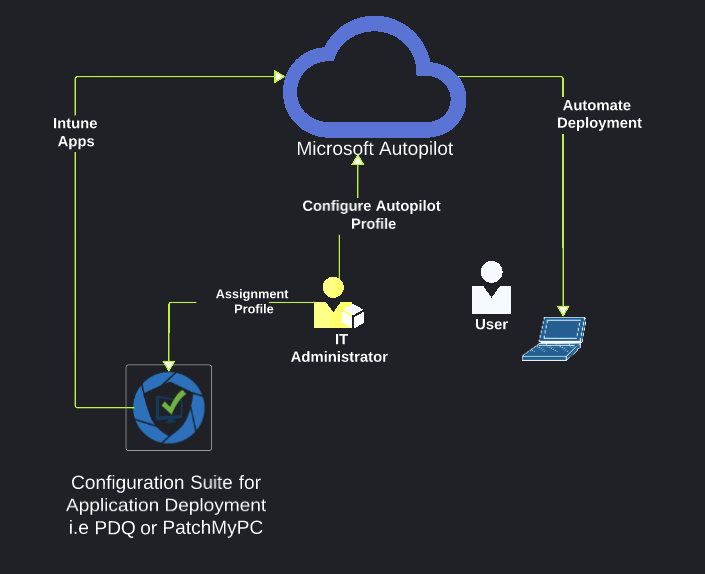
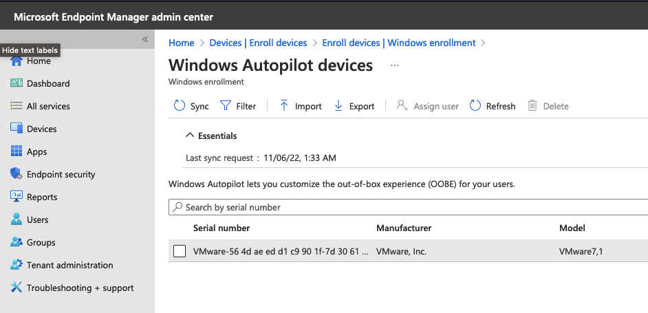

<h1 align="center"> Windows Autopilot </h1>

 

----

## Table of Contents
----
- [Overview](#overview)
- [Environment](#environment)
- [Configuration](#configuration)
- [License](#license)
- [Author](#author)

# Overview
Windows Autopilot is a collection of technologies used to set up and pre-configure new devices, getting them ready for productive use. Windows Autopilot can be used to deploy Windows PCs or HoloLens 2 devices.


# Resources


---
| Resource | Link |
| --- | --- |
| Windows Autopilot | https://docs.microsoft.com/en-us/windows/deployment/windows-autopilot/ |
| Windows Autopilot | https://docs.microsoft.com/en-us/windows/deployment/windows-autopilot/windows-autopilot-reset |
| Windows Autopilot | https://docs.microsoft.com/en-us/windows/deployment/windows-autopilot/windows-autopilot-requirements |
| Windows Autopilot | https://docs.microsoft.com/en-us/windows/deployment/windows-autopilot/windows-autopilot-requirements |

---


# Configuration 

#### Windows Autopilot Deployment (For Testing)



```powershell
# Enable Windows Autopilot Deployment on Setup Screen

1. Access Powershell by pressing Shift + F10 on the Setup Screen
2. Run the following command:
Install-Script -Name Get-WindowsAutoPilotInfo -Scope CurrentUser -Force
# 
3. Run the following command:
Get-WindowsAutoPilotInfo -Online

4. Login with your Microsoft Account (Global Admin)

```

#### License
[MIT](https://choosealicense.com/licenses/mit/)

#### Author
[Murtadha Marzouq](http://www.findasnake.com 
    )