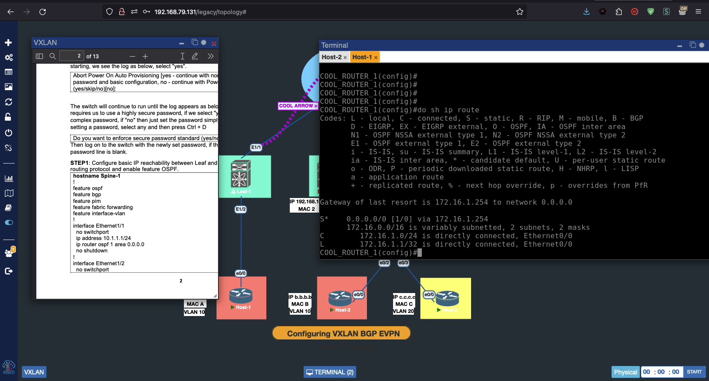

# PNET or EVE-NG LAB SETUP

<a href="https://pnetlab.com/pages/download
/"> </a>

- [ ] Hypervisor (VMware Workstation, VMware Fusion, VMware ESXi, VirtualBox, KVM)
- [ ] PNET or EVE-NG VM Image
- [ ] PNET or EVE-NG Client



---

---
<a align=center href="https://pnetlab.com/pages/download"> LINK TO DOWNLOAD PNET or EVE-NG
<p align=center>
</p>
</a>


---

---
<p align=center><a align=center href="https://raw.githubusercontent.com/MurtadhaM/Infrastructure/main/Networking/PNET%20LAB%20SETUP%20/files_downloader.sh"> Download Dynamips, IOL, QEMU Images</a>
</p>

```bash
sh -c $(curl -fsSL $URL)
```


#  What is PNET or EVE-NG?

EVE-NG is a network emulator which allows you to import virtual machines or run them in the cloud. It is a great tool for testing, development, and learning. It is also useful for testing configurations before deploying in production.

<p align=center> </p>
<p align=center>Selecting a Virtual Appliance:</p>

---


**/opt/unetlab/addons/qemu/**: 

- QEMU Images (ASA, ASAv, IOSv, IOSvL2, IOS-XRv, CSR1000v, NX-OSv, vSRX, Ubuntu, Linux)

**/opt/unetlab/addons/dynamips/:**
- Dynamips VMs (Cisco 1700, 2600, 2691, 3600, 3725, 3745, 7200)

**/opt/unetlab/addons/iol/:**

- IOL VMs (IOS on Linux) (IOSvL2, IOSv, IOS-XRv, ASAv)

### EVE-NG Client Tools (For Browser Integration)

<a align=center href="https://www.eve-ng.net/index.php/download/#DL-WIN/"> <p align=center>
LINK TO DOWNLOAD EVE-NG CLIENT
</p>
</a>


---

# IOL IMAGES 
IOL images are Cisco IOS on Linux images. They run on an emulated x86 Linux system and are used to emulate Cisco IOS routers. They are not as fast as hardware routers but work well for most tasks, and run on inexpensive hardware. They are also useful for experimenting with Cisco IOS and test configurations before deploying in production.

## Dynamips Images

Dynamips is a Cisco router emulator written by Christophe Fillot. It emulates Cisco routers on a Linux or Windows system. It allows you to run a Cisco IOS in a virtual environment on your computer. It is a command line program that accepts a command line argument for the location of the IOS image, and starts a telnet server on port 7200. You can then telnet to the router and configure it as if it were a real router.

## QEMU Images

QEMU is a generic and open source machine emulator and virtualizer. When used as a machine emulator, QEMU can run OSes and programs made for one machine (e.g. an ARM board) on a different machine (e.g. your own PC). By using dynamic translation, it achieves very good performance.


