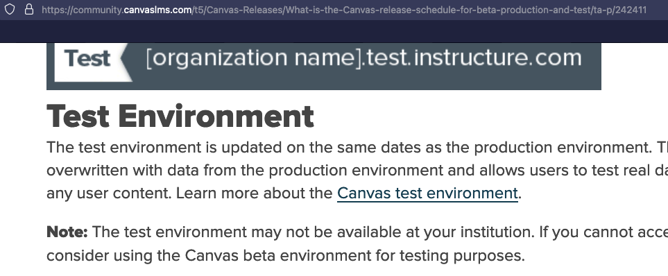
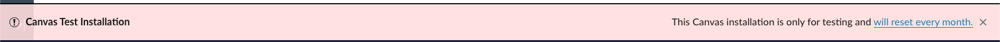

# Canvas Quiz Security

## Description
2 Subdomains are used for testing that can be exploited to bypass quiz security. The subdomains are:
- [x] `*.test.instructure.com`


- [x] `*.beta.instructure.com`

## Impact
---


The impact of this vulnerability is that a student can view the quiz questions and answers before taking the quiz. This can also be exploited by a student to take the quiz multiple times without penalty.

## Explanation:
---

Due to the time in which these test systems are reset, a students quiz submissions can be viewed by a student and even attempted without penalty. This is due to the fact that the quiz submissions are not reset when the test system is reset. This can be exploited by a student to view the quiz questions and answers before taking the quiz. This can also be exploited by a student to take the quiz multiple times without penalty.

```text
The Following is a quote from the Canvas Release Schedule Documentation that shows that the test & beta are:
1. A copy of the production system
2. Reset on a regular basis

```

---


### Test Environment


*.test.instructure.com: is a test system that is reset every month. 

```text
The test environment is updated on the same dates as the production environment. The test environment is overwritten with data from the production environment and allows users to test real data without compromising any user content. Learn more about the Canvas test environment.
```

### Beta Environment


*.beta.instructure.com: is a test system that is reset every week.

```text
The beta environment is for testing and QA review before code is released to the production environment. This code is available in the production environment approximately one month later, pending customer feedback and QA testing. Learn more about the Canvas beta environment.
```

## Proof of Concept
---


## How I Discovered & Tested
---


  1. I Requested a Development Canvas Course from Charlotte's Request a Canvas Course Form. <a href="https://spaces.charlotte.edu/pages/viewpage.action?pageId=34603100" target="_blank">Request a Canvas Course</a>

2. I created a quiz with 1 attempt allowed

3. I waited for the test system to be synced with the production system


4. I was able to attempt the quiz multiple times without penalty and view the quiz questions and answers before taking the quiz.

5. I reported the issue to Canvas Security Team & Canvas Support


## Resources
---


 
- [x] [Canvas Release Schedule](https://community.canvaslms.com/t5/Canvas-Releases/What-is-the-Canvas-release-schedule-for-beta-production-and-test/ta-p/24241)

- [x] [Canvas Test Environment](https://community.canvaslms.com/t5/Canvas-Releases/What-is-the-Canvas-release-schedule-for-beta-production-and-test/ta-p/242411)

- [x] [Resource](https://community.canvaslms.com/t5/Instructor-Guide/How-do-I-access-the-Canvas-beta-environment-as-an-instructor/ta-p/727)

- [x] [Resource](https://community.canvaslms.com/t5/Canvas-Releases/What-is-the-Canvas-release-schedule-for-beta-production-and-test/ta-p/242411)
## Additional Information
---

Use the following screenshots to help you identify the test and beta environments.





<!--


---
-->
