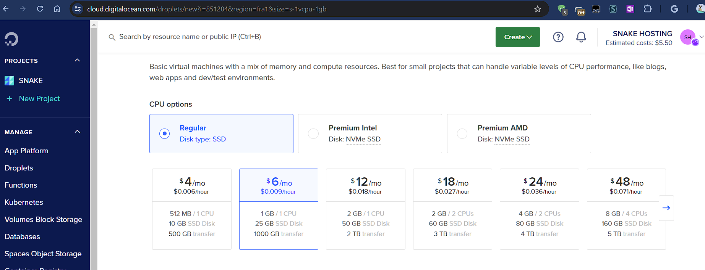
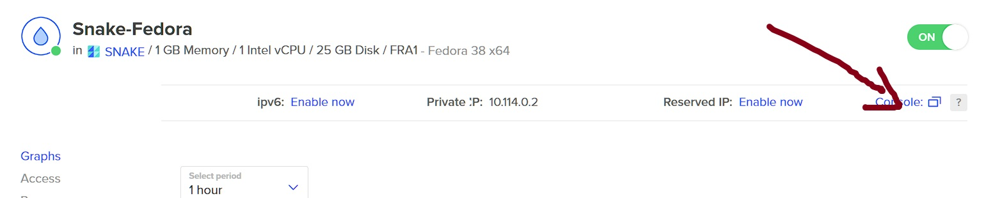
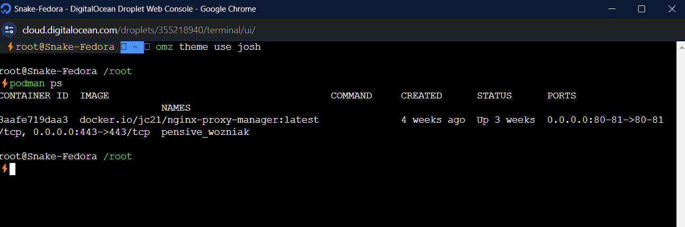
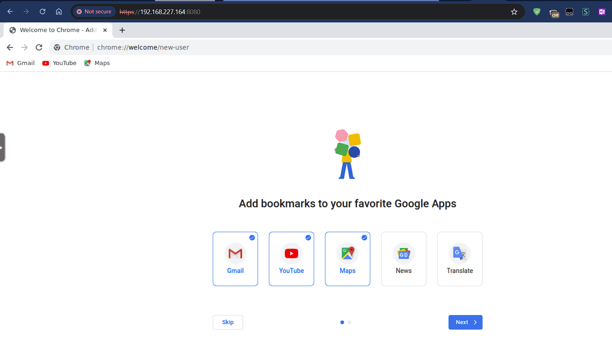

# Complete Privacy with KasmWeb
---
<p align="center">  </p>

### Table of Contents
- [Complete Privacy with KasmWeb](#complete-privacy-with-kasmweb)
    - [Table of Contents](#table-of-contents)
    - [Description](#description)
  - [Prerequisites](#prerequisites)
  - [Connection Setup \& Installation](#connection-setup--installation)
  - [Accessing Remote Browser](#accessing-remote-browser)
  - [`` The URL will be: the IP of the https://droplet_public_ip:8080``](#-the-url-will-be-the-ip-of-the-httpsdroplet_public_ip8080)

### Description
---
KasmWeb is a containerized application that allows you to run a browser in a container. This allows you to have a browser that is completely isolated from your host machine. This is useful for browsing the web without having to worry about your privacy.

`` Note: This is a very basic setup and is not meant to be used for anything other than browsing the web.`` 

- Source:  [KasmWeb](https://hub.docker.com/r/kasmweb/chrome)

---
## Prerequisites


- [x] Create a new droplet with the following configurations:

`` Cost: $5/month``

```bash
- Ubuntu 20.04
- 1vCPU
- 1GB RAM
- 25GB Disk
- 1TB Transfer
```

-  Create a new Droplet Example


## Connection Setup & Installation


- [x] Web SSH Console

`` Web SSH Console: ``
- [x] Through the Web SSh Console, Install podman


```bash
sudo apt-get update -y 
sudo apt-get install podman -y
```
-  Podman Installation Demo




- [x] Create a container using the following command:

```bash
## CREATE A USER THAT IS NOT ROOT

sudo useradd -m -s /bin/bash user
sudo usermod -aG sudo user
sudo passwd user 
su user


### CREATE A CONTAINER USING PODMAN PORT 8080:6901 LOCAL:CONTAINER and VNC_PW=password
VNC_PW=password
LOCAL_PORT=8080
CONTAINER_PORT=6901
SHARED_MEMORY=512m # 512MB of shared memory 
podman run -it -d -p $LOCAL_PORT:$CONTAINER_PORT --shm-size=$SHARED_MEMORY -e VNC_PW=$VNC_PW  kasmweb/chrome:1.14.0 

### DEBUGGING
# EDIT THE PODMAN REPO FILE (Maybe) by adding the following line to the file /etc/containers/registries.conf
sudo echo "unqualified-search-registries = ['docker.io']" >> /etc/containers/registries.conf

```

## Accessing Remote Browser


- [x] Access the browser by going to the following URL:

`` The URL will be: the IP of the https://droplet_public_ip:8080``
---

Default Username: kasm_user
Default Password: password

-  Accessing the Remote Browser
