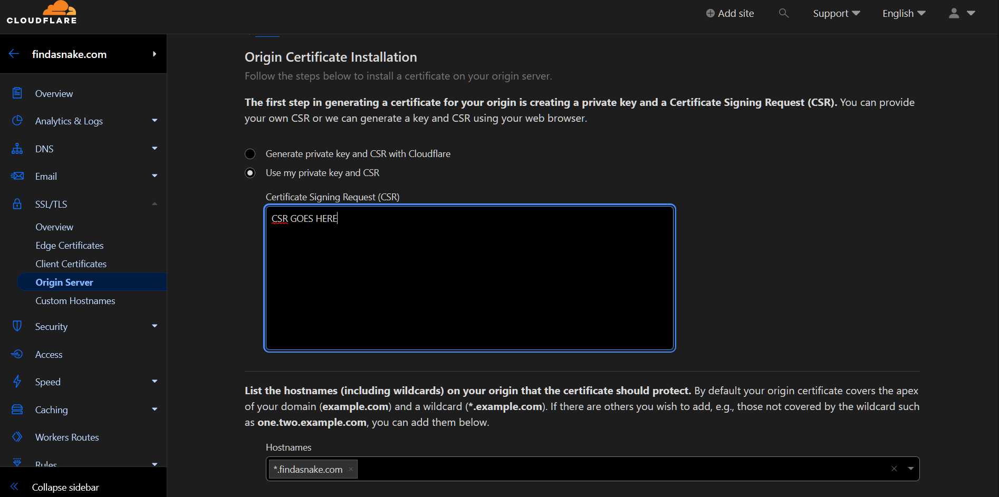
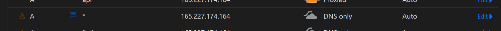

## Setting up a reverse proxy with NginxProxyManager with a Wildcard SSL Certificate

- [x] Goal: Use a single wildcard SSL certificate for multiple subdomains automatically 


- [x] Dependencies
  - Publically accessible server to act as a reverse proxy
  - Podman & Podman-Compose cause screw docker 😊😊
  - A domain name
    - A Cloudflare account with the domain name
    - A Cloudflare API token with the following permissions <a href="https://dash.cloudflare.com/profile/api-tokens">here</a> 
      - Zone - Zone - Edit
    -  A wildcard SSL DNS record with a certificate image.pngissued by Cloudflare <a href="https://dash.cloudflare.com/929ec37202defab79c90cb35c96b348f/findasnake.com/ssl-tls/origin">here</a> or <a href="https://dash.cloudflare.com/929ec37202defab79c90cb35c96b348f/findasnake.com/ssl-tls/client-certificates">here</a>

---
- [x] **Dashboard in CloudFlare**


---

- [x] **Wildcard Certificate in CloudFlare**


---

- [x] **Wildcard A Record in CloudFlare ** pointing to the reverse proxy server


---

## **Setting up the reverse proxy server**


- [x] SETUP Permissions and Disabling SELinux

```bash
echo "SELINUX=disabled" > /etc/selinux/config
setenforce 0
# Create the directories for the data and letsencrypt
mkdir data 
mkdir letsencrypt
chmod 777 data
chmod 777 letsencrypt
chown -R 1000:1000 data
chown -R 1000:1000 letsencrypt
```
---

- [x] API Variables

```bash

export CF_Token= "" # API Token from Cloudflare
export CF_Zone_ID =""
export # Wont need this 
CF_Account_ID="" # Wont need this
````

- [x] Podman Compose File


```bash
curl https://get.acme.sh | sh -s email=my@findasnake.com
/root/.acme.sh/acme.sh --issue --dns dns_cf -d fuck.findasnake.com

```

- [x] Dependencies 

- Ubuntu / Debian

```bash
sudo apt update
sudo apt install vim certbot  python3-certbot-dns-cloudflare python3-pip
```

- CentOS / RHEL / Fedora
```bash
sudo dnf -y install epel-release
sudo dnf -y install vim certbot python3-certbot-dns-cloudflare python3-pip
```

- [x] Crypto Tools
```bash
sudo python3 -m pip install -U pyOpenSSL cryptography
```
- [x] Config Export
```bash
mkdir -p ~/.secrets/certbot
sudo tee /etc/letsencrypt/dnscloudflare.ini > /dev/null <<EOT
- [x] Cloudflare API token used by Certbot
dns_cloudflare_api_token = 
```
- [x] Permissions

```bash

sudo chmod 0600 /etc/letsencrypt/dnscloudflare.ini
```

- [x] run the certbot manually
```bash
sudo certbot certonly -d *.findasnake.com  --dns-cloudflare --dns-cloudflare-credentials /etc/letsencrypt/dnscloudflare.ini \    --post-hook "service nginx reload" --non-interactive --agree-tos     --email someone-who-pays-attention-to-emails@findasnake.com
```

- [x] Compose File
```yaml
version: '3.8'
services:
  app:
    image: 'jc21/nginx-proxy-manager:latest'
    restart: unless-stopped
    ports:
      - '80:80'
      - '81:81'
      - '443:443'
    volumes:
      - ./data:/data
      - ./letsencrypt:/etc/letsencrypt
```

- [x] Docker Compose

```bash
podmon-compose up -d
```

**NOTES**:

http://local;
